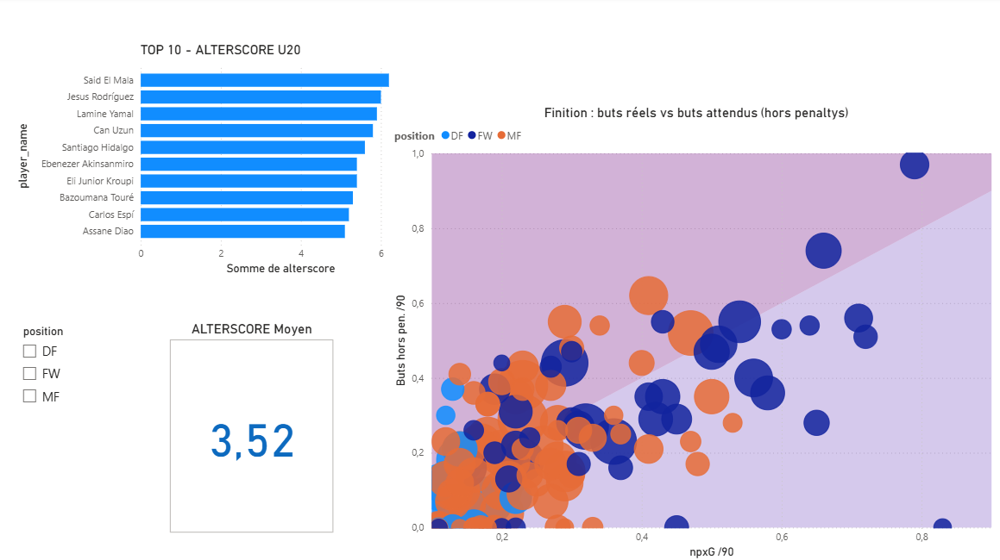
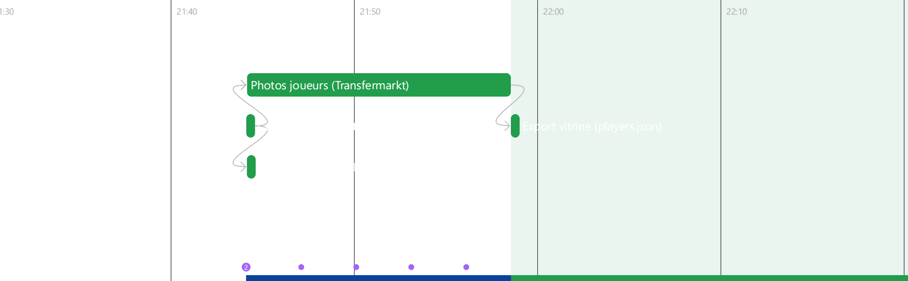

# ALTER11 — Talent Radar 🔵

> Data. Foot. Instinct. — Underrated Soccer Talent

## 🎯 Concept

ALTER11 est un projet data football centré sur les jeunes joueurs U20 des 5 grandes ligues européennes. L'objectif : identifier les profils sous-radar, sous-évalués, à potentiel — ceux que personne ne regarde encore.

L'**ALTERSCORE** est un indice composite sur 10 qui évalue le potentiel d'un joueur selon :

- Sa performance par poste (/90 min) — métriques différentes selon FW, MF, DF
- Pour les attaquants : buts hors penalty, qualité des occasions (npxG), volume de tirs, précision de tir
- Sa régularité (% du temps de jeu disponible)
- Un bonus jeunesse (17→18→19→20 ans)
- Un coefficient d'exposition médiatique (malus/bonus club, basé sur le niveau réel de l'équipe)
- Un coefficient de fiabilité (basé sur le volume de minutes)

## 📊 Dashboard Power BI



Top 10 ALTERSCORE filtrable par poste, et analyse de finition
(buts réels vs buts attendus hors penaltys) sur 251 joueurs U20.
Généré depuis `scripts/export_power_bi.py`.

## ⚙️ Pipeline et contrôles qualité



Le pipeline est orchestré avec **Prefect** (`flows/pipeline_alter11.py`) : scraping,
enrichissement xG/xA, création de la vue de scoring, contrôles qualité, puis exports vers
la vitrine et le dashboard. La vue `v_alterscore` est recréée à chaque exécution, ce qui
garantit que la base reflète toujours la formule versionnée dans git plutôt qu'une
version figée lors d'un run passé.

```bash
pip install prefect pytest
python flows/pipeline_alter11.py                 # exécution complète
python flows/pipeline_alter11.py --skip-scraping # repart de la base existante
```

**Les contrôles qualité sont une étape bloquante.** Si un test échoue, tout l'aval est
annulé : ni `players.json` ni `alter11_power_bi.csv` ne sont régénérés. C'est la raison
d'être de cette orchestration — les quatre bugs de données du projet étaient tous
silencieux (aucune erreur levée, des scores simplement faux) et ont tous été publiés
avant d'être découverts, à la main, en creusant une incohérence.

La suite `tests/test_data_quality.py` (13 tests, `pytest tests/ -v`) couvre :

| Famille | Exemples |
| ------- | -------- |
| Intégrité relationnelle | pas de stats orphelines, pas de doublon joueur |
| Régressions historiques | postes canoniques, âge entier, precision_tir ∈ ]0,1[ |
| Invariantes métier | npxG ≤ xG, tirs cadrés ≤ tirs, `nineties` = minutes/90, malus club dans [0.70, 1.15] |
| Fraîcheur des sources | couverture Understat ≥ 95% des joueurs à 200+ minutes |

Un test est volontairement marqué `xfail` : trois joueurs agrègent les stats de deux clubs
ou de deux homonymes sur une seule ligne (`matches_played` > nombre de journées du
championnat). Aucun n'est U20, donc l'ALTERSCORE n'est pas affecté — le test reste en
place pour détecter toute nouvelle collision, avec la raison documentée dans le code.

Le flow gère aussi deux détails que la version manuelle imposait : des retries sur les
tâches réseau (FBref et Understat coupent régulièrement sur du rate limiting), et la
dépendance photos → vitrine, qui rendait nécessaire de lancer `export_vitrine_data.py`
deux fois de suite.

## 🛠️ Stack technique

- **Python** — nettoyage, scraping (FBref, Transfermarkt, Understat), ACP, clustering (pandas, scikit-learn, BeautifulSoup, rembg)
- **SQLite** — base de données relationnelle (3 tables + tables de référence)
- **SQL** — requêtes analytiques, CTEs, window functions, scoring composite
- **Prefect** — orchestration du pipeline (DAG, retries, contrôles qualité bloquants)
- **pytest** — 13 tests de qualité de données sur la base SQLite
- **Power BI** — dashboard interactif (slicers, KPI, nuage de points avec ligne de symétrie)
- **HTML/CSS/JS** — vitrine web interactive déployée sur GitHub Pages, données chargées dynamiquement (aucune valeur codée en dur)

## 📁 Structure du projet

```
ALTER11/
├── data/
│   ├── raw/                  # Datasets FBref bruts (2024-25, 2025-26)
│   ├── clean/                 # Données nettoyées
│   └── photos/                 # Photos joueurs (détourées, via Transfermarkt)
├── notebooks/
│   └── 01_analysis.ipynb      # Pipeline complet : nettoyage → ACP → clustering → scoring
├── sql/
│   ├── 00_view_alterscore.sql # VUE v_alterscore : source unique de la formule
│   ├── 01_schema.sql          # Création des tables
│   ├── 02_kpi_u20.sql         # Requêtes analytiques KPI
│   └── 03_alterscore.sql      # Top 10 par poste (consomme la vue)
├── scripts/
│   ├── find_similar_players.py       # Scoring de similarité entre joueurs (ACP)
│   ├── scrape_2024_2025.py           # Scraping saison 2024-25 (validation)
│   ├── validate_alterscore.py        # Validation prédictive de l'ALTERSCORE
│   ├── scrape_understat.py           # Enrichit fact_stats avec xG/xA/npxG (Understat)
│   ├── generate_cards.py             # Récupère et détoure les photos joueurs (Transfermarkt)
│   ├── export_power_bi.py            # Génère alter11_power_bi.csv (dashboard Power BI)
│   └── export_vitrine_data.py        # Génère players.json depuis alter11.db (vitrine)
├── flows/
│   └── pipeline_alter11.py     # Orchestration Prefect du pipeline complet
├── tests/
│   └── test_data_quality.py    # 13 tests de qualité de données (pytest)
├── docs/                       # Captures dashboard et pipeline
├── run_alterscore.py           # Exécute 03_alterscore.sql et affiche le top par poste
├── alter11.db                  # Base SQLite
├── alter11_power_bi.csv         # Table plate pour Power BI, généré depuis alter11.db
├── players.json                 # Données de la vitrine, généré depuis alter11.db
└── index.html                   # Vitrine web ALTER11 (charge players.json en fetch())
```

## 📊 Modèle de données

| Table         | Description                                          |
| ------------- | ----------------------------------------------------- |
| `dim_team`    | Clubs des 5 grands championnats                       |
| `dim_player`  | ~2600 joueurs toutes ligues                           |
| `fact_stats`  | Stats saison par joueur (FBref + Understat)           |
| `malus_clubs` | Coefficients d'ajustement club (0.70 à 1.15)          |

## 🏆 Ligues couvertes

| Ligue          | Pays               |
| -------------- | ------------------ |
| Ligue 1        | 🇫🇷 France          |
| La Liga        | 🇪🇸 Espagne         |
| Serie A        | 🇮🇹 Italie          |
| Premier League | 🏴󠁧󠁢󠁥󠁮󠁧󠁿 Angleterre |
| Bundesliga     | 🇩🇪 Allemagne       |

## 🔍 Méthodologie ALTERSCORE

Le score est calculé différemment selon le poste (FW = attaquant, MF = milieu,
DF = défenseur) — un défenseur et un attaquant ne sont pas évalués sur les mêmes
critères. Les termes techniques (npxG, PPM, min%…) sont définis dans le
[glossaire](#-glossaire) en fin de README :

- **FW** — buts hors penalty/90 (25%), npxG/90 (7%), tirs/90 (8%), précision de tir (10%),
  passes déc/90 (15%), min% (15%), PPM équipe (5%)
- **MF offensif** — impact offensif/90, tirs/90, activité défensive/90, fautes subies/90,
  PPM équipe, min%
- **MF défensif** — tacles/90, interceptions/90, fautes subies/90, PPM équipe, min%
- **DF** — tacles/90, interceptions/90, centres/90, fautes subies/90, PPM équipe, min%

Tous les postes intègrent un bonus jeunesse dégressif et un coefficient de fiabilité basé
sur le volume de minutes jouées.

**La formule est définie une seule fois**, dans la vue SQL `v_alterscore`
(`sql/00_view_alterscore.sql`). Le top 10 SQL, l'export Power BI et l'export vitrine
lisent cette vue plutôt que de recopier le calcul — voir "Limites connues" pour le bug
qui a motivé ce choix. La vue est volontairement large (tous les U20 non-gardiens, sans
filtre de minutes) : c'est à chaque consommateur de filtrer selon son besoin.

**Sur le choix np_goals + npxG plutôt que les buts bruts** : les penalties sont exclus pour
ne pas avantager un tireur attitré sur des situations qu'il ne crée pas lui-même. Le npxG
est ajouté en poids faible (7%, pas 25%) en complément du résultat réel — il corrèle à 0.83
avec les buts hors penalty (vérifié empiriquement), donc un poids égal aurait été redondant ;
un poids faible ajoute un signal de qualité sans dupliquer l'information.

Le détail complet de la démarche (ACP, biplot, clustering par profil de jeu) est documenté
dans `notebooks/01_analysis.ipynb`.

## 🎯 Scoring de similarité

`scripts/find_similar_players.py` trouve les joueurs au profil de jeu le plus proche d'un
joueur donné, via une distance dans l'espace ACP (analyse en composantes principales :
les 8 statistiques de jeu sont résumées en quelques axes synthétiques, et deux joueurs
proches sur ces axes ont un profil de jeu comparable — mêmes variables que l'ALTERSCORE
hors club/âge). Le xG/xA (Understat) est affiché à titre informatif à côté des résultats mais
**n'entre pas** dans le calcul de similarité — testé et écarté à deux reprises : d'abord en
valeur brute (corrélation 0.84 avec les stats déjà utilisées, redondant), puis en écart
buts-xG (trop bruité sur le faible volume de tirs d'un jeune sur une saison, ce qui donnait
des similarités moins cohérentes à l'usage).

```bash
python scripts/find_similar_players.py "Lamine Yamal"
```

## ⚠️ Limites connues

Ce projet est une V1 assumée comme telle. Les points suivants sont identifiés et
volontairement documentés plutôt que masqués :

- **Pas de validation prédictive convaincante — et le premier résultat était un piège.**
  J'ai recalculé l'ALTERSCORE (sans malus club) sur les U20 de 2024-2025, puis regardé
  s'il prédisait leur évolution de temps de jeu en 2025-2026. Premier résultat :
  corrélation *négative* et significative (Spearman r=-0.32, p<0.001, n=117) — les joueurs
  les mieux notés voyaient leur temps de jeu baisser. En creusant, c'est un artefact de
  régression vers la moyenne (un joueur déjà à 90% de temps de jeu ne peut quasiment que
  baisser, faute de marge au-dessus) : la variable cible (Δ% temps de jeu) est fortement
  anti-corrélée au temps de jeu initial (r=-0.50), qui entre lui-même dans la formule du
  score via `min_pct`. Testé sur une cible non biaisée (% de temps de jeu absolu en
  2025-2026) : **r=-0.001, p=0.99** — aucune corrélation, ni positive ni négative.
  Conclusion assumée : l'ALTERSCORE décrit une performance passée, il ne prédit pas le
  temps de jeu futur — qui dépend largement de facteurs hors données (mercato, choix du
  coach, blessures). Limites de la validation elle-même : biais de survie (18% des joueurs
  ont quitté les 5 championnats entre les deux saisons et sortent donc de l'échantillon —
  or ce sont probablement les moins performants, ce qui tronque la mesure) et échantillon
  réduit par poste (13 attaquants). Voir `scripts/validate_alterscore.py`.
- **Clustering non stabilisé.** Le K-Means est lancé avec une seed fixe pour la
  reproductibilité, mais les clusters ne sont pas garantis stables si on relance avec
  d'autres seeds. Pas de test de robustesse (multi-seeds, bootstrap) à ce stade.
- **Pondérations choisies à la main.** Les poids de l'ALTERSCORE sont fixés par jugement
  métier, pas appris ou optimisés sur une cible externe.
- **Variables limitées, et ce n'est pas (que) un choix.** FBref a perdu l'accès à ses
  données avancées fournies par Opta le 20 janvier 2026, suite à une rupture de contrat
  avec Stats Perform
  ([source](https://www.sports-reference.com/blog/2026/01/fbref-stathead-data-update/)).
  Les dribbles réussis et les duels aériens (qui auraient permis de mieux distinguer un
  profil dribbleur créatif d'un profil pivot physique — cas concret identifié sur le
  scoring de similarité) ne sont donc plus disponibles publiquement. Alternatives
  vérifiées et écartées : Sofascore et WhoScored via `soccerdata` ne donnent pas accès à
  ces stats au niveau saison via les outils gratuits actuels ; un dataset Kaggle annoncé
  plus complet s'est avéré être une version antérieure à la coupure.
- **xG/xA disponibles via Understat**, une source indépendante d'Opta donc non affectée
  par la coupure (`scripts/scrape_understat.py`). Le matching des noms entre les deux
  sources a nécessité plusieurs passes (normalisation des accents, score combiné
  nom+club, puis vérification manuelle ligne par ligne) pour atteindre 100% de couverture
  sur les joueurs à minutes suffisantes — un cas concret où le fuzzy matching seul créait
  des faux positifs (ex : deux joueurs différents nommés "Rayan" tous deux matchés sur un
  candidat "Rayan" générique via `partial_ratio`).
- **Malus club recalibré en cours de route.** La formule initiale ne descendait jamais
  sous 1.0 pour les clubs faibles (ils étaient "un peu moins pénalisés" plutôt que
  vraiment boostés), malgré une plage annoncée de 0.70 à 1.15. Corrigée en interpolation
  linéaire entre le meilleur et le pire club des 5 championnats, sur leur PPM réel — la
  plage complète est maintenant vraiment utilisée.
- **Trois bugs de données silencieux trouvés et corrigés en cours de projet**, qui
  faussaient les scores sans jamais générer d'erreur visible : ~22% des joueurs avaient un
  poste stocké au format `"MF,FW"` au lieu de `"FW"` (le score devenait `NULL` et le
  joueur disparaissait silencieusement du classement) ; ~20% avaient un âge stocké au
  format FBref `"19-290"` (années-jours) plutôt qu'un entier simple, ce qui pouvait fausser
  les comparaisons SQL du bonus âge. Les deux ont été détectés en creusant une incohérence
  précise (Lamine Yamal absent du classement malgré des stats qui auraient dû le classer
  très haut) plutôt que par un audit systématique — signe qu'un audit de qualité de
  données plus large serait utile avant d'aller plus loin. Enfin, la précision de tir était
  calculée en division entière SQLite (`shots_on_target / shots` sur deux INTEGER),
  renvoyant 0 pour 97% des joueurs et 1 pour les rares ayant cadré tous leurs tirs — ce qui
  annulait silencieusement une composante de 10% du score des attaquants. Cause racine : la
  formule était dupliquée dans trois fichiers et un seul n'avait pas la correction.
- **Un quatrième bug, découvert en écrivant les tests de qualité.** Trois joueurs ont un
  `matches_played` supérieur au nombre de journées de leur championnat : deux collisions
  d'homonymes (deux Vitinha, deux Nicolás González, fusionnés en une seule ligne par la
  clé de jointure sur le nom) et un transfert mi-saison dont les lignes des deux clubs ont
  été additionnées. Aucun n'a 20 ans ou moins, donc l'ALTERSCORE, la vitrine et le
  dashboard ne sont pas affectés en l'état. La correction propre passe par une clé de
  jointure nom + date de naissance ; en attendant, le test correspondant reste en place,
  marqué `xfail` avec la raison documentée.
- **La formule de l'ALTERSCORE était dupliquée dans quatre fichiers** — c'est la cause
  racine du bug de précision de tir ci-dessus : une correction appliquée à trois d'entre
  eux seulement, et le dashboard s'est mis à afficher un classement différent de la
  vitrine pendant plusieurs semaines, sans qu'aucune erreur ne soit levée. Résolu depuis
  par une vue SQL, `sql/00_view_alterscore.sql`, qui est désormais la source unique de
  vérité : le top 10 SQL, l'export Power BI et l'export vitrine la consomment au lieu de
  recopier le calcul, et le pipeline la recrée à chaque exécution pour que la base
  reflète toujours la version versionnée dans git. Seul `validate_alterscore.py` garde
  sa propre implémentation, en Python : il rejoue le score sur un CSV de la saison
  précédente qui n'est pas chargé dans la base, la vue ne peut donc pas le servir.

## 🚀 Lancer le projet

```bash
git clone https://github.com/Janaud14/ALTER11.git
cd ALTER11
pip install pandas jupyter ipykernel scikit-learn matplotlib beautifulsoup4 rapidfuzz scipy soccerdata rembg pillow prefect pytest

# Tout le pipeline, orchestré (scraping -> qualité -> exports) :
python flows/pipeline_alter11.py

# Contrôles qualité seuls :
pytest tests/ -v

# Pipeline complet (nettoyage, ACP, clustering, scoring) :
jupyter notebook notebooks/01_analysis.ipynb

# Ou juste le scoring final, si la base est déjà construite :
python run_alterscore.py

# Enrichir la base avec xG/xA (Understat), utilisé par le scoring de similarité :
python scripts/scrape_understat.py

# Trouver des joueurs similaires à un profil donné :
python scripts/find_similar_players.py "Lamine Yamal"

# Exporter le CSV du dashboard Power BI :
python scripts/export_power_bi.py

# Validation prédictive de l'ALTERSCORE (2024-25 vs 2025-26) :
python scripts/scrape_2024_2025.py
python scripts/validate_alterscore.py
```

## 🌐 Vitrine web

**[janaud14.github.io/ALTER11](https://janaud14.github.io/ALTER11)**

`index.html` ne contient aucune donnée codée en dur — il charge `players.json` au
démarrage, généré à partir de la vraie base (mêmes calculs que `sql/03_alterscore.sql`),
pour tous les U20 éligibles. Chaque carte affiche 6 statistiques spécifiques au poste du
joueur, avec un glossaire en info-bulle et un bouton "Comment ça marche" qui explique la
méthodologie en langage clair — pensé pour qu'un visiteur non-initié comprenne les scores
sans avoir à lire ce README.

Pour régénérer la vitrine après une mise à jour des stats ou des photos, le plus simple
est de laisser le flow gérer l'ordre des étapes :

```bash
python flows/pipeline_alter11.py --skip-scraping
```

Manuellement, l'ordre compte — `players.json` doit être généré après les photos, sinon il
référence des images qui n'existent pas encore :

```bash
python scripts/generate_cards.py        # récupère les photos manquantes (Transfermarkt)
python scripts/export_vitrine_data.py   # génère players.json depuis alter11.db
```

Les photos sont récupérées sur Transfermarkt (photo de profil haute résolution, pas la
vignette de recherche) puis détourées en local avec `rembg` (modèle `u2net_human_seg`,
spécialisé silhouettes humaines, avec alpha matting pour préserver les mèches de cheveux)
— aucune clé API nécessaire.

## 📖 Glossaire

Le projet croise du vocabulaire football et du vocabulaire data. Les termes qui reviennent
le plus souvent, pour que le README se lise sans connaître les deux domaines :

**Football**

| Terme | Signification |
| ----- | ------------- |
| **FW / MF / DF** | Attaquant / Milieu / Défenseur (notation FBref) |
| **/90** | Statistique ramenée à 90 minutes jouées, pour comparer un titulaire et un remplaçant sur la même base |
| **xG** | *Expected goals* — nombre de buts qu'une occasion "aurait dû" produire, estimé d'après sa qualité (distance, angle, type d'action) |
| **npxG** | xG hors penalty (*non-penalty xG*) |
| **xA** | *Expected assists* — même logique que le xG, appliquée aux passes menant à un tir |
| **Buts hors penalty** | Buts marqués hors coups de pied de réparation, pour ne pas gonfler le total d'un tireur attitré |
| **PPM** | Points par match de l'équipe sur la saison — proxy du niveau collectif dans lequel évolue le joueur |
| **min%** | Part du temps de jeu disponible effectivement jouée |
| **U20** | Joueurs de 20 ans ou moins |

**Data**

| Terme | Signification |
| ----- | ------------- |
| **ACP** | Analyse en composantes principales — réduit une dizaine de statistiques à 2-3 axes synthétiques, pour visualiser et comparer des profils de jeu |
| **K-Means** | Algorithme de clustering : regroupe automatiquement les joueurs aux statistiques proches, sans étiquette prédéfinie |
| **Corrélation de Spearman** | Mesure entre -1 et +1 de la force d'un lien entre deux variables (0 = aucun lien). Comparée à la corrélation de Pearson, elle travaille sur les rangs et résiste mieux aux valeurs extrêmes |
| **p-value** | Probabilité d'observer un tel résultat si aucun lien n'existait réellement. Sous 0.05, on considère le résultat difficilement attribuable au hasard |
| **Régression vers la moyenne** | Tendance des valeurs extrêmes à se rapprocher de la moyenne à la mesure suivante. Un joueur à 95% de temps de jeu ne peut quasiment que baisser — pas parce qu'il régresse, mais parce qu'il n'y a plus de marge au-dessus |
| **Biais de survie** | Ne mesurer que les cas encore observables, en oubliant ceux qui ont disparu de l'échantillon (ici : les joueurs partis hors des 5 championnats) |
| **Fuzzy matching** | Rapprochement de chaînes de caractères non identiques mais proches, pour relier un même joueur entre deux sources qui l'orthographient différemment |

## 📡 Source des données

- [FBref](https://fbref.com) — statistiques saison, standard/tirs/temps de jeu/discipline
- [Transfermarkt](https://transfermarkt.com) — position détaillée, valeur marchande, photos
- [Understat](https://understat.com) — xG, xA, npxG (modèle indépendant d'Opta)

---

*ALTER11 — Data. Foot. Instinct.*
